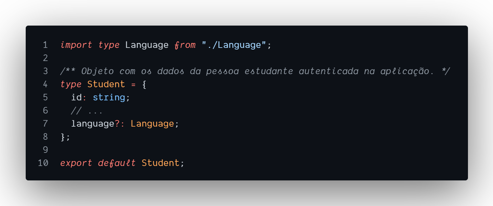
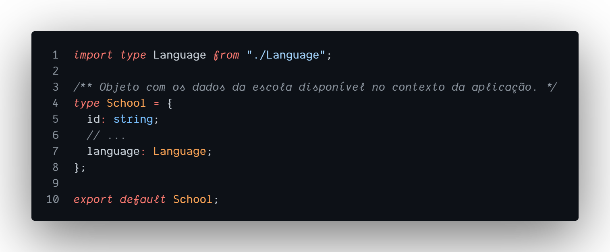
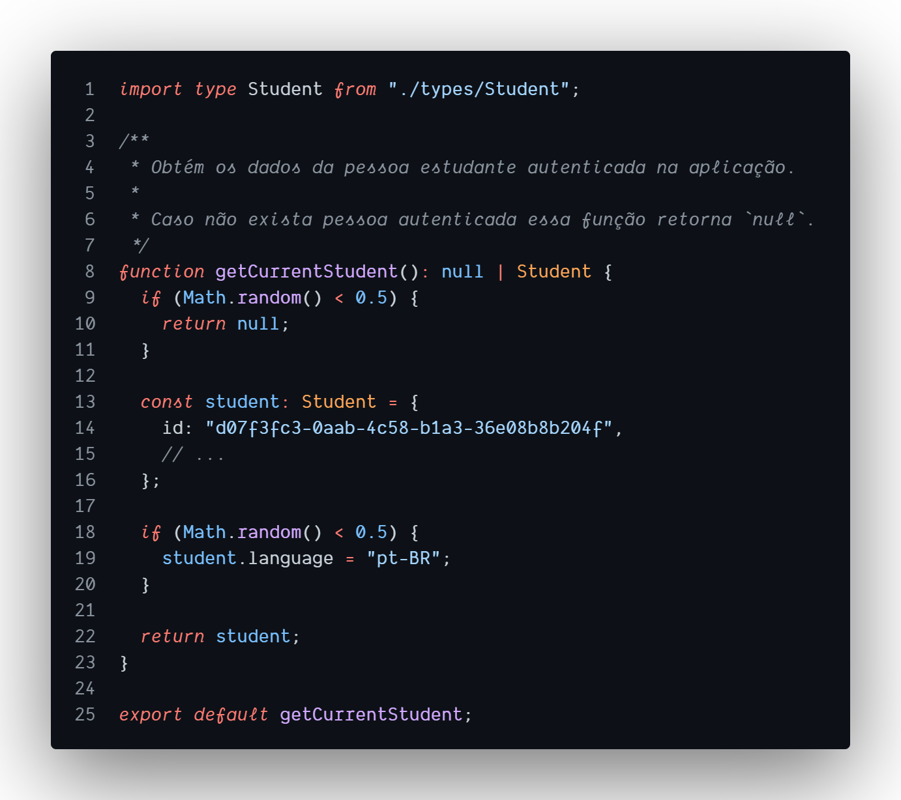
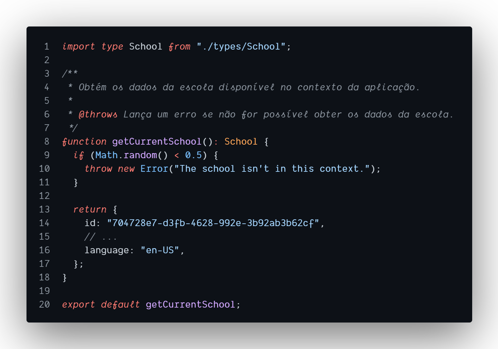

# `Maybe` / `Option`

## Cenário

Hipotéticamente estamos trabalhando numa aplicação que disponibiliza cursos de inúmeras escolas, e eles são consumidos por pessoas estudantes. E temos que fazer a resolução do idioma usado nessa aplicação.

1. A aplicação suporta apenas o português brasileiro e o inglês estadunidense.

  

2. É possível obter o idioma dos dados da pessoa estudante, porém ele não é um atributo obrigatório.

  

3. É possível obter o idioma dos dados da escola.

  

4. Existe uma função para obter os dados da pessoa estudante autenticada na aplicação, porém ela pode retornar `null` se não houver pessoa autenticada.

  

5. Existe também uma função para obter os dados da escola, porém quando não houver escola no contexto acessado um erro é lançado.

  
